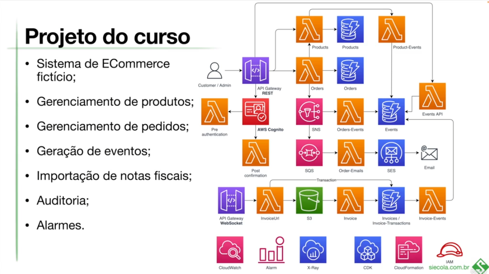

# Welcome to your CDK TypeScript project

## project

This project represents a simple ECommerce System using resource/stacks from AWS like CDK, Lambda, DynamoDB, SNS, SQS, S3, EventBridge and Gateway with typescript.

## Structure Project


This is a blank project for CDK development with TypeScript.

The `cdk.json` file tells the CDK Toolkit how to execute your app.

## Useful commands

* `npm run build`   compile typescript to js
* `npm run watch`   watch for changes and compile
* `npm run test`    perform the jest unit tests
* `npx cdk deploy`  deploy this stack to your default AWS account/region
* `npx cdk diff`    compare deployed stack with current state
* `npx cdk synth`   emits the synthesized CloudFormation template


## package.json suggested by instructor
```
"devDependencies": {
    "@types/aws-lambda": "^8.10.125",
    "@types/jest": "^29.5.5",
    "@types/node": "20.7.1",
    "@types/uuid": "^9.0.6",
    "aws-cdk": "2.114.1",
    "@aws-cdk/aws-apigatewayv2-alpha": "^2.114.1-alpha.0",
    "@aws-cdk/aws-apigatewayv2-integrations-alpha": "^2.114.1-alpha.0",
    "aws-sdk": "^2.1485.0",
    "jest": "^29.7.0",
    "ts-jest": "^29.1.1",
    "ts-node": "^10.9.1",
    "typescript": "~5.2.2"
  },
  "dependencies": {
    "aws-xray-sdk": "^3.5.3",
    "aws-cdk-lib": "2.114.1",
    "constructs": "^10.0.0",
    "source-map-support": "^0.5.21"
  }
```

## Creating project
  mkdir EComerceAWS

  cd EComerceAWS

  cdk init --language typescript

  Set-ExecutionPolicy RemoteSigned
    rodar no powershell como adm para habilitar execução de scripts 

  cdk list
    lista todas as stacks do projeto

  cdk bootstrap
    cria um bucket na s3, só precisa ser executado uma unica vez por conta e região

  cdk deploy --all
    faz o deploy de todas as stacks

  cdk destroy --all
    destroi todos os recursos

  cdk deploy --all --require-approval never
    faz o deploy sem requisitar questões durante o processo

## Dependencies added
  npm install aws-sdk --save-dev
  npm install @types/aws-lambda --save-dev
  npm install @types/uuid --save-dev